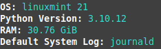
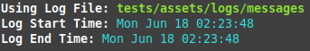
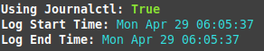
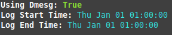
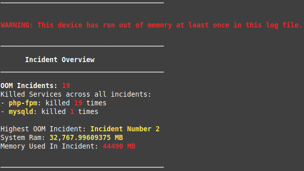
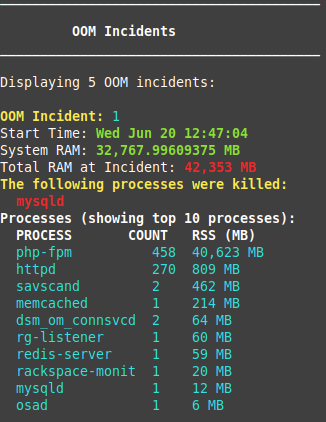
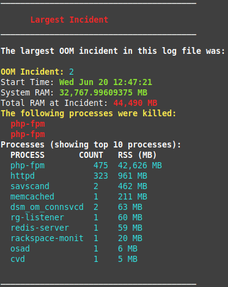

# Out-Of-Memory Investigation .py
  
  
Python 2.7.x - 3.x compatible  

The following python script can be used to calculate the estimated RSS (RAM) value of each service at the time a kernel invoked OOM killer.

At the time of an OOM incident, the system logs the estimated RSS value of each service in its system log. Based off of this information the script will calculate how much RAM the services were "theoretically" trying to use, the total RAM value of all services and how much RAM your system actually has to offer these services. Allowing for further investigation into the memory usage of the top "offending" service(s).

The script can check:

- Default system log
- Journald
- Dmesg

This script is designed to run on the following systems (that have python 2.7+):

- Ubuntu
- Debian
- RHEL
- CentOS
- RockyLinux
- AlamaLinux
- OSX

More systems can be added. Please request [here](https://github.com/LukeShirnia/out-of-memory/issues/new) if you want something specific. 

 

##  Running

### Installation/Running
There are 3 methods of running the script:

- Via git:
  -  `git clone git@github.com:LukeShirnia/out-of-memory.git;`
  -  `cd out-of-memory;`
  -  `python oom_investigate.py`

- Installation via pip:
  -  `git clone git@github.com:LukeShirnia/out-of-memory.git;`
  -  `cd out-of-memory;`
  -  `pip install .`
  -  `oom_investigate`

- `curl https://raw.githubusercontent.com/LukeShirnia/out-of-memory/v2/oom_investigate.py | python`
  - WARNING: This isn't safe. You should probably grab the latest commit and curl that instead if you REALLY want to curl.

## Usage:

## Output Information:

The output from this script can be broken down into 4 main sections:
- System info
- Log file info
- Warning overview
- Incident overview

### Section 1 - System Info
This section gives you a quick breakdown of the sytem the script has been executed on
 

### Section 2 - Log File Info
Information about which log file the script is using
 
  
  
  

### Section 3 - Warning Overview
If at least one oom incident is detected, the script will first run, then create a summary overview.  
It will attempt to inform you of the following information:
- How many incidents have occurred in log
- What services were killed and how many times
- What incident was the worst and the RAM consumed at the time of this incident

 

### Section 4 - Incident Overview
By default the script will show the first 5 OOM incidents. You can show more or less. You can also show the incidents in reverse with `--reverse` flag.  

If there are a large amount of oom incidents, the top RAM consuming incident probably won't be in the script output unless `--all` is specified.  
To make sure we always show the worst incident, a new section will be created at the beginning of the output:

